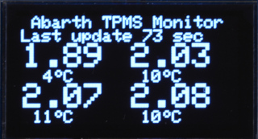
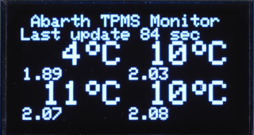
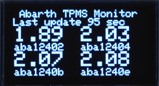

# MODULES

[DISP](#disp)<br>
[OIL](#oil)<br>
[RGB](#rgb)<br>
[TPMS](#tpms)<br>

## DISP

[Index](#modules)<br>

Configure the way the display shows data.

```
$ usbget -c DISP
D=0 M=1 S=2 L=15

$ usbget -s DISP -p "M=1;S=1"
```

* D - Device: OLED display chip

  Parameter: device number [0-1]

  0 = SH1106<br>
  1 = SDD1306
  
* M - Mode: Select which screens are displayed.

  Parameter: mode number [0-2]
  
  0 = Display a single screen<br>
  1 = Toggle between two screens<br>
  2 = Switch all screens round robin
  
* S - Screen: Set screen number for modes 0 and 1.

  Parameter: screen number [0-4]
  
  0 = Pressure and temperature<br>
  <br>
  
  1 = Temperature und pressure<br>
  <br>

  2 = Pressure and Sensor ID<br>
  <br>

  3 = Statistics 1<br>
  <br>
    
  4 = Statistics 2<br>
  
  
* L - Last update indicator: Automatically remove the "Last update" line.

  Parameter: number of seconds [0-65535]
  
  The "Last update xx sec" line displayed only if the time since last update is larger than the configured value.

## OIL

[Index](#modules)<br>

Oil pressure and temperature.

This modules has no configurable parameters.

## RGB

[Index](#modules)<br>

RGB LED

Set RGB color values in percent. [0-100]

```
$ usbget -s RGB -p "R=100" -p "G=50" -p "B=50"
$ usbget -s RGB -p "R=100;G=50;B=50"

$ usbget -c RGB
R=100 G=50 B=50
```

## TPMS

[Index](#modules)<br>

Tire Pressure Monitoring System

```
$ usbget -c TPMS
0=00000000
1=00000000
2=00000000
3=00000000
0 ID=aba12401 T=2.0 P=2.22 S=10
1 ID=aba1240e T=19.0 P=2.25 S=10
2 ID=aba12402 T=18.0 P=2.26 S=9
3 ID=aba12403 T=15.0 P=1.99 S=7
4 ID=00000000 T=0.0 P=0.00 S=0
5 ID=00000000 T=0.0 P=0.00 S=0
6 ID=00000000 T=0.0 P=0.00 S=0
7 ID=00000000 T=0.0 P=0.00 S=0
8 ID=00000000 T=0.0 P=0.00 S=0
9 ID=00000000 T=0.0 P=0.00 S=0
10 ID=00000000 T=0.0 P=0.00 S=0
11 ID=00000000 T=0.0 P=0.00 S=0
```

ID=Sensor T=Temperature P=Pressure S=Score

The score is used to identify your own sensors in case we temporary receive data from other cars sensors.<br>
Whenever a data package for a sensor is received the sensor gets a boost of 10 points.
Every 20 seconds the score decreases by one point.

Sensors are sorted by score and the top 4 sensors are displayed.

If you know your sensor IDs you can use<br>
```
usbget -s TPMS -p "0=wwwwwwww;1=xxxxxxxx;2=yyyyyyyy;3=zzzzzzzz"
```
to reserve the first 4 slots for your sensors.<br>
Obviously you need to replace the wwwwwwww .. zzzzzzzz with your sensor IDs.


If no sensors have been set or all of the sensor IDs are cleared by 

```
usbget -s TPMS -p "0=00000000;1=00000000;2=00000000;3=00000000"
```

the sorting algorithm is used.

